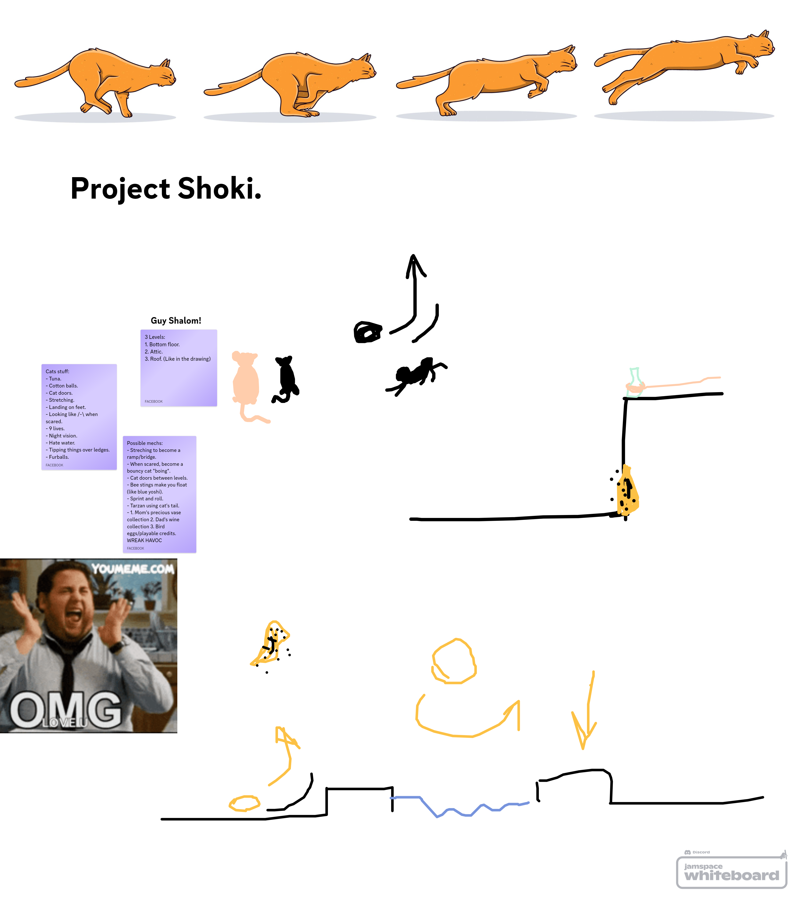

# Meow-Project
## About
### A cat-themed co-op platformer demo
This project is being developed in Godot and is planned to support Windows desktop platforms. In the future, we plan to create releases for mobile phones (iOS and Android)

Stay Tuned For More Info!

## Developers
Guy Shalom

Yonatan Shabot

## Roadmap
Planned to be released in July 2025!

